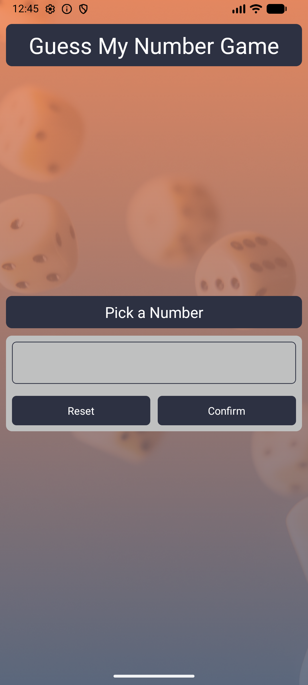
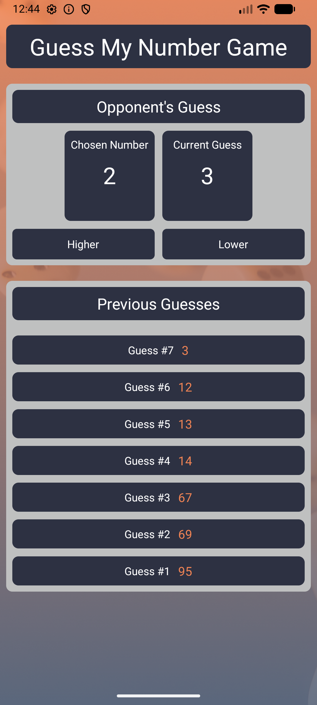
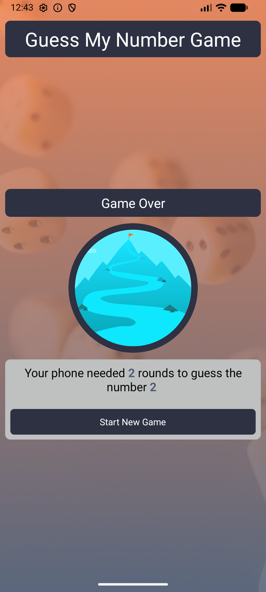

# Guess My Number

A simple Expo React Native game where you pick a number and the phone tries to guess it.

## Features
- Start-game dialog where the user selects a number between 1 and 99.
- In-progress game screen with Higher/Lower buttons to guide the phone's next guess.
- Guess history log showing previous guesses.
- Game-over screen showing how many rounds the phone needed and a button to start a new game.

## Screenshots

### Start Game
`gamestart.png` shows the start game dialogue where the user picks a number.

### Game In Progress
`inprogress.png` shows the game in progress, including the buttons to tell the phone if it's below or above the actual number and also the log of guesses.

### Game Over
`gameover.png` shows the screen displayed when the phone successfully guesses the number.

## How to Run
1. Ensure you have Expo CLI installed (`npm install -g @expo/cli`).
2. Navigate to the project root.
3. Install dependencies with `npm install`.
4. Start the app with `expo start`.
5. Scan the QR code with Expo Go on your device or run in an emulator.

## Credits
This app was built as part of the [React Native - The Practical Guide](https://www.udemy.com/course/react-native-the-practical-guide/) course on Udemy.
